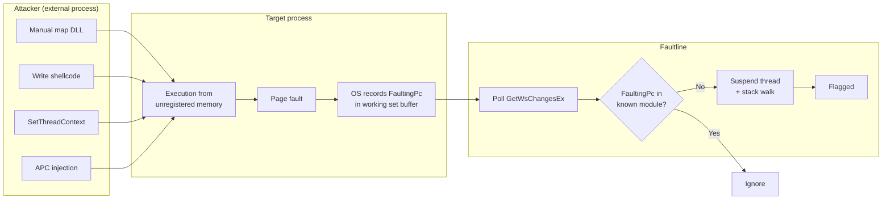

# Faultline

An anticheat proof of concept that detects execution from manually mapped memory by monitoring working set page faults and walking the call stack of suspicious threads.

## How it works

Windows tracks page faults per process through the working set watch API (`InitializeProcessForWsWatch` / `GetWsChangesEx`). Every time a page is brought into the working set, the OS records the instruction pointer (`FaultingPc`) that triggered the fault.

Faultline polls these events, checks whether each `FaultingPc` falls within a known loaded module, and flags execution from memory regions that are executable but not backed by any module in the PEB. When a suspicious fault is detected, the faulting thread is suspended and its stack is walked to capture the full call chain.

This catches code that was injected via manual mapping, shellcode injection, or similar techniques where the executable memory is never registered with the Windows loader.

## Thread hijacking detection from usermode

This is where it gets interesting. If an external process hijacks a thread inside the host via `SetThreadContext` / `NtSetContextThread`, APC injection, or similar techniques and redirects execution into injected memory, the page fault still fires. The `FaultingPc` still resolves to memory outside any known module, and faultline catches it.

There isn't really a clean way to detect thread hijacking today. There's no kernel callback for context changes, and while ETW can trace the relevant syscalls, that's indirect at best. Faultline sidesteps the problem entirely by observing the side effects of execution rather than trying to intercept the redirection itself. It doesn't matter how the thread got there or who pointed it there. If it executes from unregistered memory and faults a page, it's visible.

## Components

| Directory  | Description |
|------------|-------------|
| `anticheat/`  | Core detection DLL. Monitors working set faults, classifies memory regions, walks stacks |
| `host/`    | Minimal target process that loads the detection DLL |
| `injector/`| Manual mapper that injects the test payload into the host process |
| `payload/` | Test DLL that executes from manually mapped memory to trigger detection |
| `shared/`  | Common headers (logger, RAII handles, utilities) |

## Usage

1. Start `host.exe`
2. Run `injector.exe` in a separate terminal
3. The host console will log any detected suspicious execution along with stack traces

The injector supports two modes:

- **Remote thread** (default): `injector.exe` creates a new thread in the host via `CreateRemoteThread`
- **Thread hijack**: `injector.exe --hijack` redirects an existing host thread via `SetThreadContext`

Both trigger detection, but the host runs a background game loop thread that serves as the hijack target

## Demo

## Limitations

- The working set watch API only fires on the first access to a page. Once a page is resident in the working set, further execution from it is invisible.
- Detection is reactive. By the time the fault is observed, the injected code has already run.
- Code caves or patches within legitimate modules will not be caught since the `FaultingPc` resolves to a known module range.
- The poll-based design means short lived threads may exit before a stack walk can be performed.
